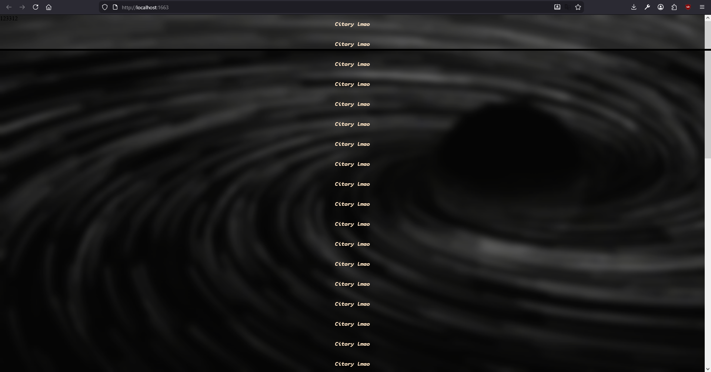

<H1 align="center">
	-==[ www.citory.net ]==-
	<br> <strike>CoolMegaDuperPuperMyWebSiteWWWcitoryDotnet</strike>
    <br> <strike>(Kill me pzl)</strike>
    <br> <strike>(Kill me pzz)</strike>
    <br> <strike>I hate my keyboard//</strike>
    <br> ...
</H1>

<H3 align="center">
	-==[ Site Preview ]==-
</H3>	
<p align="center">
    <a target="_blank" href="https://github.com/fantasyaxe/mushroom">
        
    </a>
</p>

<H3 align="center">
	-==[ Setup this sh1t ]==-
</H3>	
<p align="center">

<!-- Why json? IDK -->
```json
1. npm install
2. npm run dev
    2.1 or: npm run build

Dev url: 0.0.0.0:1663
PROFIT!!!
```

</p>